# 页面结构

## login

登录界面,登录后跳转到主界面

## register

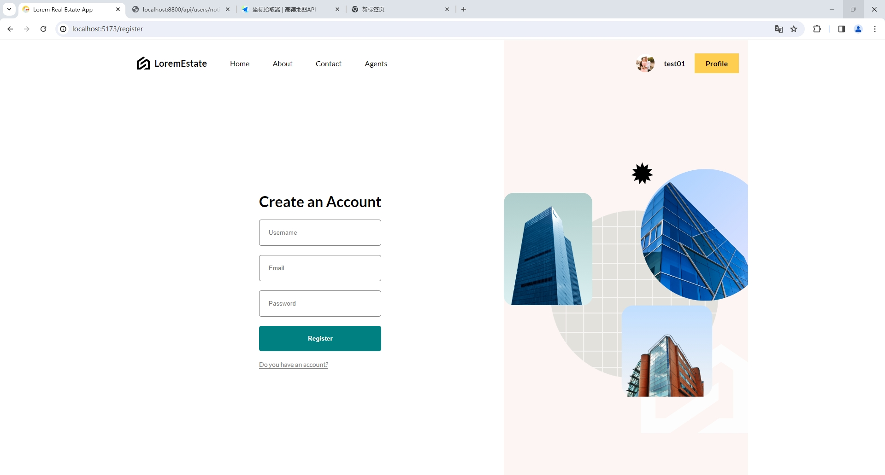
注册界面,注册成功后返回登录界面

## homePage

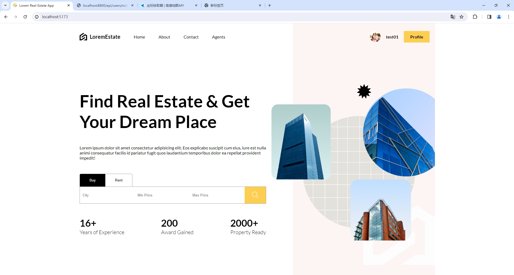
主界面,输入条件后点击搜索按钮跳转到 listPage 并显示查询后的结果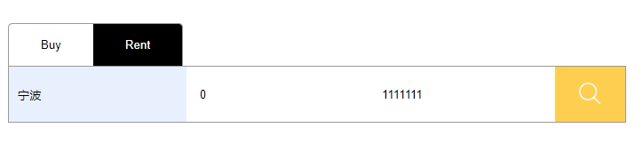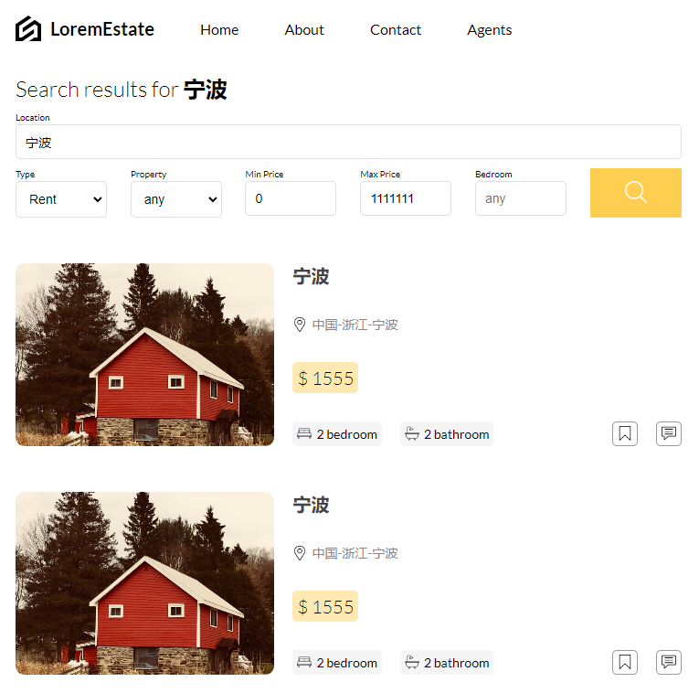

## listPage

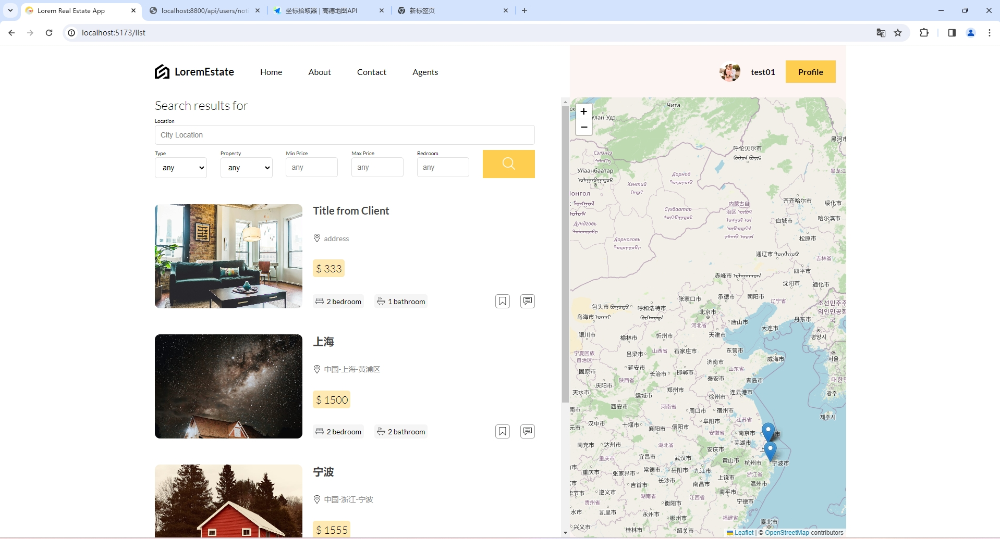
默认显示所有的 Posts,在地图上有每一个 Post 位置对应的 pin 图标,在此可以设置更具体的查询条件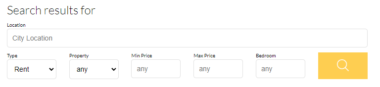

## profilePage

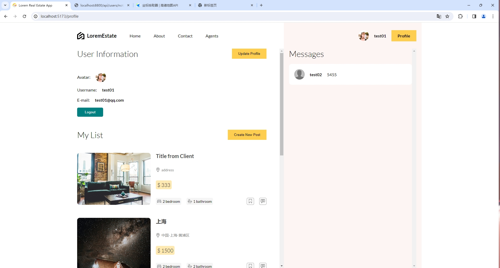
个人信息界面,可以修改个人信息,或者发布新的 Post,以及登出.
左侧显示 Mylist 以及 Saved List,右侧显示当前的聊天,可以与其他用户实时对话
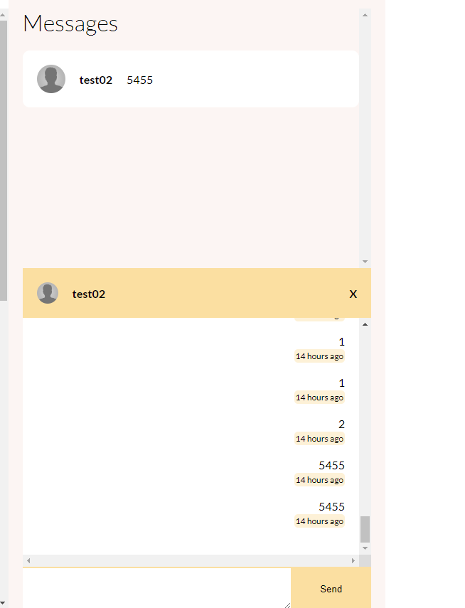

## singlePage

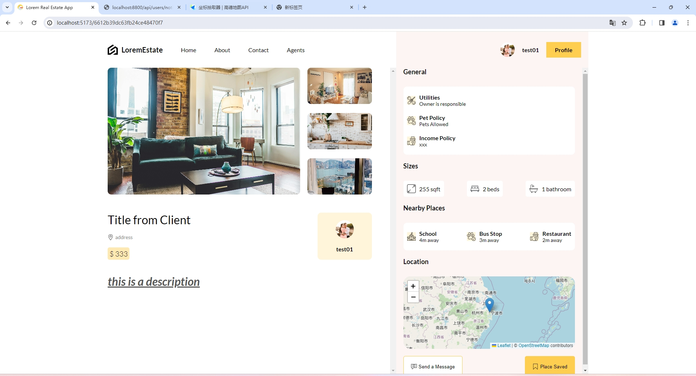
在 profilePage 或 listPage 里点击单个 Post 会跳转到对应 Post 的 singlePage,里面包含详细信息,以及图片等.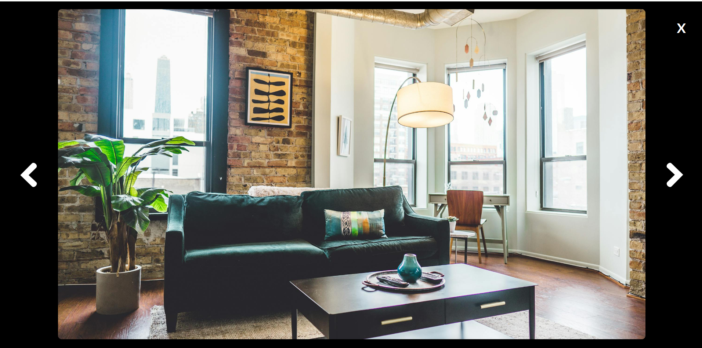点击图片可以放大查看

## newPostPage

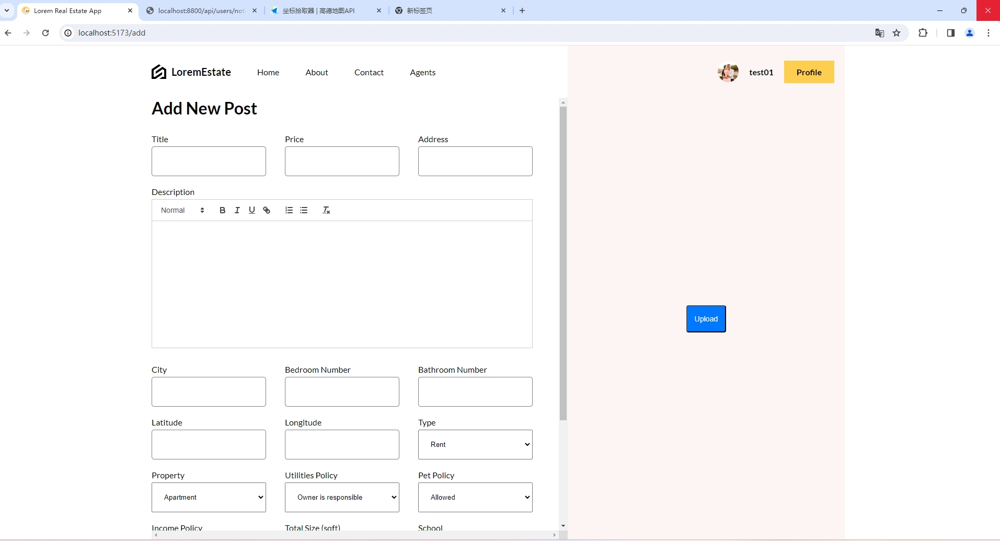
发布自己的房源具体信息,包括价格,地址,详细描述等,右侧可以上传自己的图片
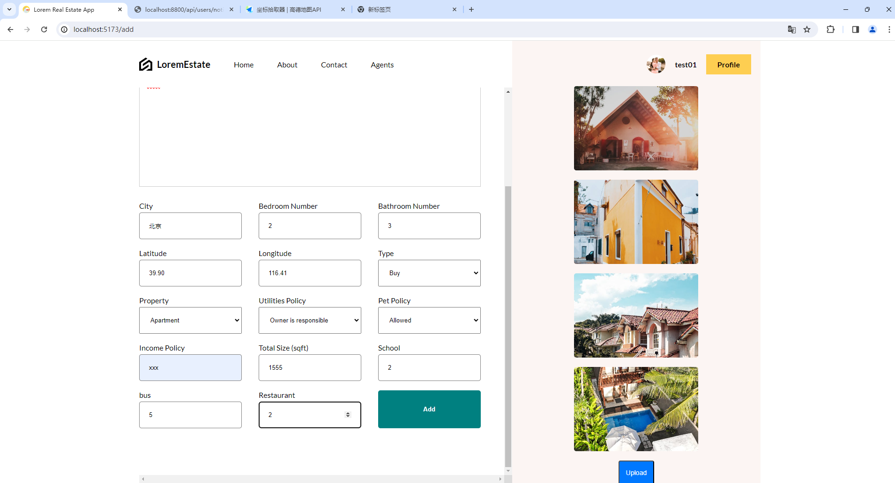
发布后,自动跳转到 singlePage 界面,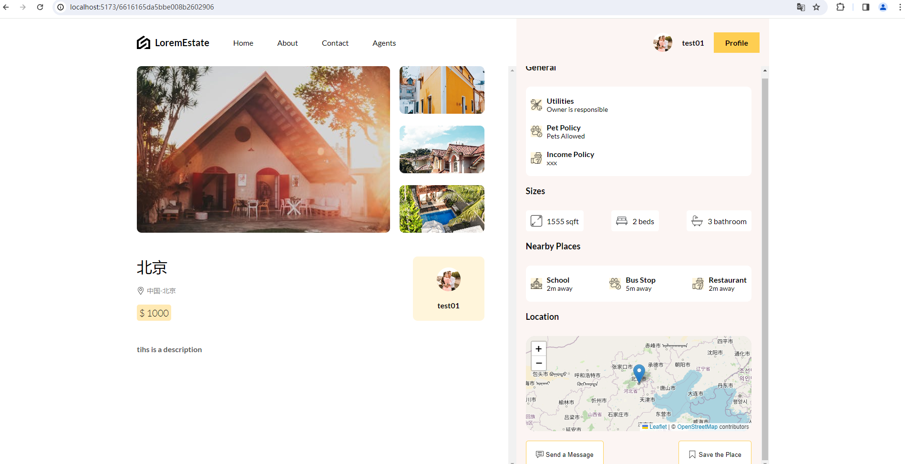

## profileUpdatePage

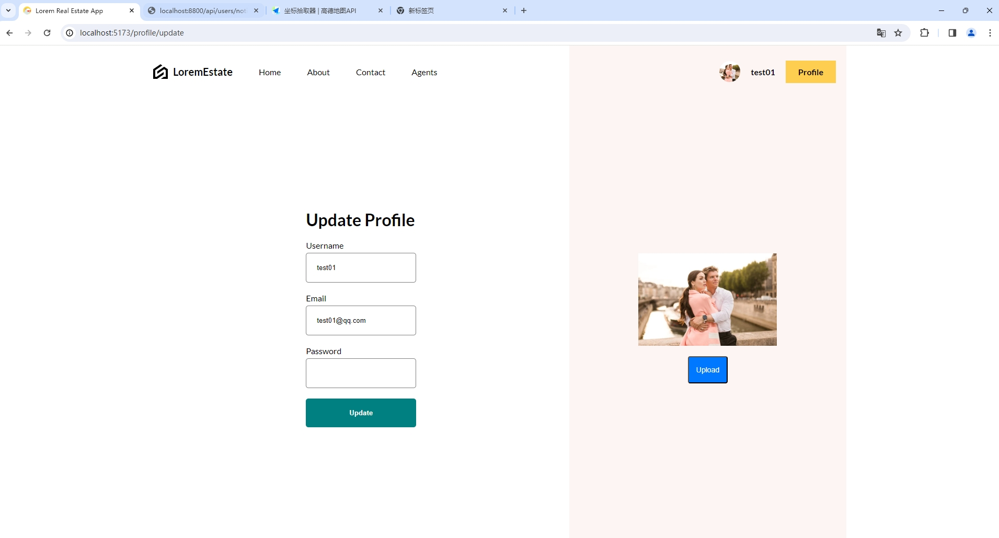
可以更新自己的头像,username,email,password 信息
